# SMS Data Collection Setup

## Intro

This guide will help you install two main components of the Medic platform:
Kujua Export and SMSSync.  This is the minimal setup you need for basic data
collection via SMS.  SMSSync is an Android application that receives SMS data
and automatically pushes or syncs the data using HTTP to another service.
Kujua Export allows you to get data out of the database in a format that a
spreadsheet program can read.

## Install SMSSync

At the time of this writing we are using a modified version of [SMSSync by
Ushahidi](http://smssync.ushahidi.com/) as the gateway; your device needs to run Android version 1.6 or higher.

### Step 1: Allow Installation of non-Market Applications 

* On your device navigate and enable **Settings > Applications > Unknown Sources**

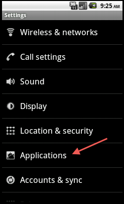
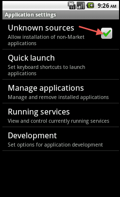

### Step 2: Download SMSSync to Device

<https://medicmobile.s3.amazonaws.com/KujuaSMSSync-debug.apk>

* Open the link above on your Android browser; you can type it manually into the address bar or send it to your phone either via SMS or email. 
* Choose **Accept** when Android prompts you to download.  The file is approximately 200KB and should download to your SD Card pretty quickly.


*Note* there are other ways to get the apk file onto your device, this was the easiest I have found.

### Step 3: Install SMSSync on Device

To install the application you have to find the apk file on your SD Card.  

* Use the native file manager to navigate to the **SD Card > Downloads** portion of the file system and choose the apk filename you downloaded in the previous step.
* Choose **Install** when Android prompts you.

*Note* if you do not have a file manager there are several free applications available on the Android Market.

## Install Kujua Export

The export tool requires CouchDB and provides a few things under the hood: a
web interface, form definitions, and a parser.  It exports the data into
useable formats compatible with programs like Excel. 

### Step 1: Install CouchDB

Kujua requires CouchDB version 1.1 or higher.  We are currently using the
Couchbase Single Server binaries.  Couchbase packages CouchDB to make it very
easy to install on any modern operating system.  

* Click the **Download** button on [Couchbase Single Server 2.0 Preview](http://www.couchbase.org/get/couchbase-single/2.0)
* Choose the right file for your operating system, if you are using Windows for example, download the .exe file.
* Launch or extract the package file and follow the instructions for your operating system to install Couchbase Single Server.

*Note* throughout this guide I refer to *CouchDB* and *Couchbase Single Server* synonymously.

### Step 2: Navigate to Replicator Screen

* Launch CouchDB
* Navigate your browser to Futon, the CouchDB admin tool, by default it can be found at <http://localhost:5984/_utils/>. 
* Click the **Replicator** item in the right column under Tools. 

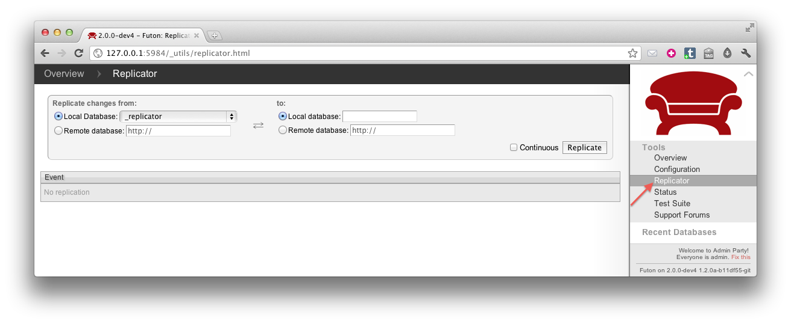

### Step 3: Replicate the Export Tool

On the Replicator screen complete the following fields and their corresponding values:

* Replicate Changes from: **Remote Database** ```https://medic.iriscouch.com/kujua-export```
* to: **Local Database** ```kujua```
* Click the **Replicate** button
* After you click replicate verify your screen updates with the replication session data:

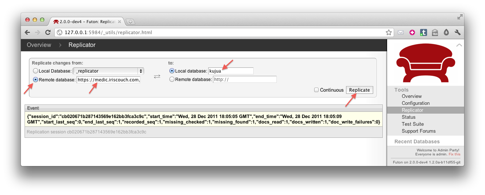

### Step 4: Verify

As a final step to verify you have Kujua Export installed, navigate to the kujua-export design doc: <http://127.0.0.1:5984/_utils/document.html?kujua/_design/kujua-export>, you should see the design doc:

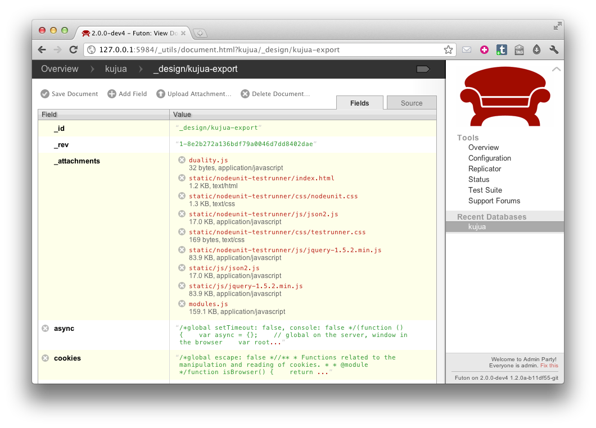

Success, the tools are installed!

## Configuration

The next section explains how to configure the gateway to send messages to
CouchDB.  This involves finding your local network IP address, more
specifically the address that CouchDB is listening on.  In this guide we assume
there are two devices on **the same IP network**, this is typically a laptop
and phone on a secured LAN.  A network connection can be established via USB
tethering, but in this guide we focus on wireless.

### Step 1: Verify your IP address

If you are on Windows the easiest way to find your IP address is:

* Start a command window by navigating to **Start > Run** then type ```cmd``` and choose **OK**.

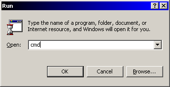

* Type ```ipconfig``` and hit return.  

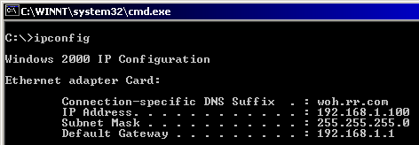

This should provide you with an IP address on the local network.  We assume you know enough about your system to find this piece of common information.

### Step 2: Verify CouchDB is listening

Now to verify CouchDB is listening on a network address you can use your web browser.  

* Type the IP address into the browser address bar and **append the following port number** prefaced with a colon ```:5984```. In this example the complete address is ```http://10.10.20.243:5984```.
* Verify you see a status message from CouchDB.


### Step 3: Verify the Export tool

* Enter the URL you discovered into a web browser and append
  the following path to it:<br />
  ```/kujua/_design/kujua-export/_rewrite/```.<br /> In this example we use 
  ```http://10.10.20.243:5984/kujua/_design/kujua-export/_rewrite/```.
* Verify that the Export app responds with a screen similiar to the one below.
* Keep this URL handy, you will need it for the next step.


### Step 4: Configure the Sync URL

Now configure SMSSync with the URL to our Export application:

* Launch SMSSync
* Edit Settings
* Choose **Enter the Sync URL** option

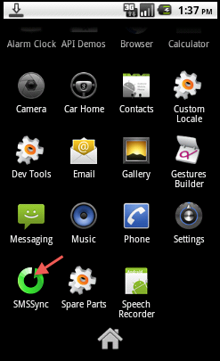
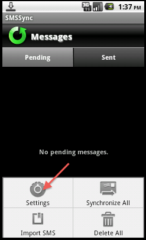
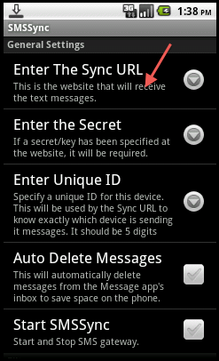

* Enter the URL you discovered in the previous step and **append one more part**: `add`. 
  e.g., `http://10.10.20.243:5984/kujua/_design/kujua-export/_rewrite/add`.
* Choose **OK**
* **Start the SMS gateway**.  You will see a status icon in the notifications bar that tells you it is running.
* Finally scroll down a bit further and set **Get Reply From Server** so the person submitting the report gets a messaging confirming it was received.

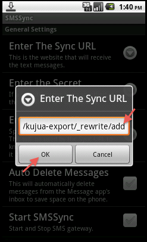
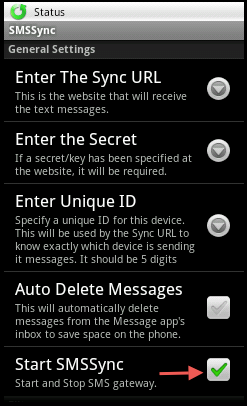
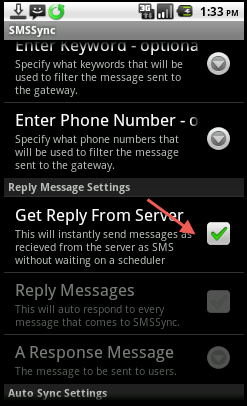

*Note:* the URL is difficult to enter manually, it is less error prone to email or sms the URL to the device so you can copy and paste it into the SMSSync dialogue box.

If you got this far without any error messages, great!  You are on the home stretch.

#### Language/Locale parameter

The gateway processes responses from Kujua so it is important that these
responses are in the correct language and locale.  If you want to specify your
locale, you can append the `locale` query parameter to the sync URL above.  The
default locale is english or `en` and we also support `fr` at the moment.  

For example, to get responses from Kujua in french use
`http://10.10.20.243:5984/kujua/_design/kujua-export/_rewrite/add?locale=fr`.

## Test the Pipes

Now the setup of the Gateway and Export tools should all be complete.  Let's see
the fruits of our labor in action; this should also help us understand how it all fits together.

### Step 1: Sync Tests

* With SMSSync running and on the main screen where you can see **Sent** and
  **Pending** tabs, send an SMS message to the Android device. *Note* you can use
  another phone or even send a message to yourself.  
* Observe the Android phone receive the message in the notification bar.
* Observe the **SMSSync Message Sent** notice.
* Choose the **Sent** tab and notice your message in the Sent box.
* Send another message but using a special **Report format**,<br />
  for example, ```1!PSMS!facility#2011#11#1#2#3#4#5#6#9#8#7#6#5#4```.
* Observe your report data in the Sent box again.

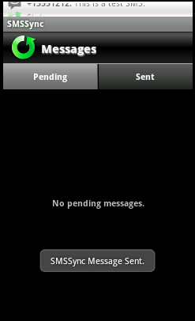
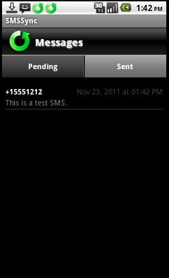
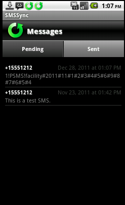

*Note*, if messages are in the Sent box that means they were successfully synced or 
saved to the database.

### Step 2: View Report Data

Now lets see if we can get our data out of the database and in a useful format; the Export tool does this.

* Browse to the export tool
* Choose the **PSMS: Download CSV** link, a file should download to your computer.


* Now open the CSV file in your favorite spreadsheet program and verify the
  formatting, field names and data look accurate.

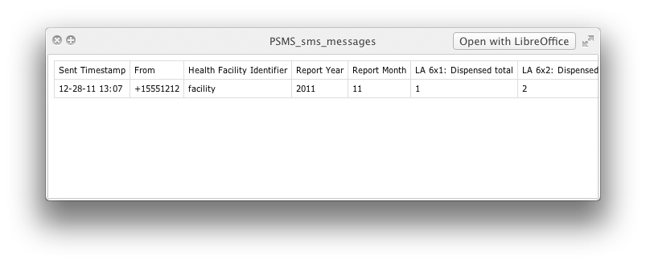

